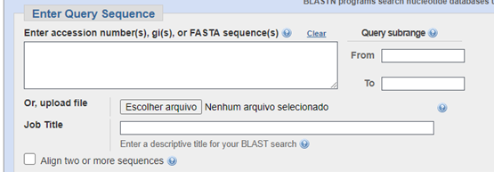
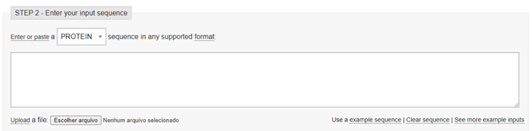
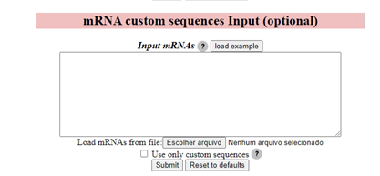
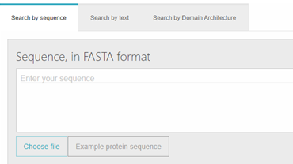

 
## Problema a ser resolvido
O usuário precisa realizar a entrada de uma sequência de nucleotídeos/aminoácidos em formato FASTA para utilizar uma funcionalidade do sistema.
 
## Situação de uso (use when)
Muitos sistemas de bioinformática, como bancos de dados de sequências, alinhadores, algoritmos de busca de sítios de ligação, necessitam de uma entrada do usuário para executar sua função. Use quando for necessário algum input de sequências personalizadas não disponíveis no sistema ou que serão comparadas com as sequências do sistema oferecido.
 
## Princípio
Flexibilidade (Mayhew's General Principles of User Interface Design, 1992).
 
## Solução
Ofereça uma área de busca com uma caixa de texto para entrada da sequência do usuário e um botão alternativo para o usuário fazer o upload diretamente de um arquivo FASTA. Idealmente, mecanismos de validação do formato da sequência também devem ser implementados. Um botão para preenchimento com uma sequência de exemplo também pode ser adicionado.
 
## Racional (why)
O padrão dá flexibilidade para o usuário realizar uma entrada de seus dados específicos, com a vantagem de escolher uma entrada por copiar/colar ou upload de um arquivo já existente no seu sistema.
 
## Exemplos

Fonte: [Nucleotide BLAST](https://blast.ncbi.nlm.nih.gov/blast/Blast.cgi?PROGRAM=blastn&PAGE_TYPE=BlastSearch&LINK_LOC=blasthome)

Fonte: [EBI Nucleotide Similarity Search](https://www.ebi.ac.uk/Tools/sss/ncbiblast/nucleotide.html)

Fonte: [ComiR](http://www.benoslab.pitt.edu/comir/index2.php)

Fonte: [EBI InterPro](https://www.ebi.ac.uk/interpro/)