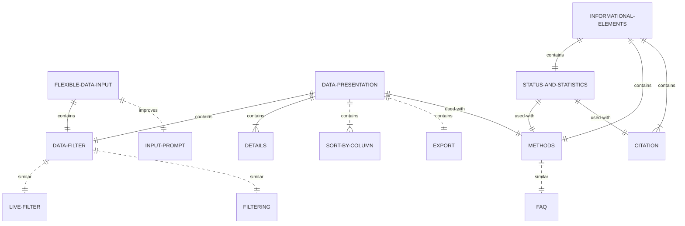

---
# Course title, summary, and position.
title: Interaction Design Patterns for miRNA target databases
linktitle: miRNA target databases
summary: "A pattern language to communicate the main solutions to common usability problems in microRNA database interfaces"

# Page metadata.
date: "2022-01-04T00:00:00Z"
toc: false  # Show table of contents? true/false
type: book  # Do not modify.

# Add menu entry to sidebar.
# - name: Declare this menu item as a parent with ID `name`.
# - weight: Position of link in menu.
weight: 10
---

## Pattern language overview

Dashed lines indicate a design pattern from an external source.

---

## List of design patterns


