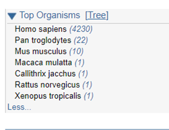
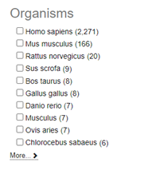

 
## Problema a ser resolvido
O usuário precisa filtrar por organismo/espécie os resultados de busca em um banco de dados de sequências biológicas.
 
## Situação de uso (use when)
Muitos sistemas de bioinformática, como bancos de dados de sequências, apresentam os resultados de uma busca (gene, proteína, amostras de sequenciamento) considerando todas as espécies disponíveis.
 
## Princípio
Flexibilidade (Mayhew's General Principles of User Interface Design, 1992).
 
## Solução
Ofereça menu de seleção ou check box para que os usuários filtrem o(s) organismo(s) de interesse na busca. Idealmente, mostre a quantidade de itens encontrados em cada organismo.
 
## Racional (why)
O padrão permite que o usuário restrinja sua busca ou facilmente compare a quantidade de resultados para cada organismo.
 
## Exemplos

Fonte: [NCBI - Geo Datasets](https://www.ncbi.nlm.nih.gov/gds)

Fonte: [EBI Search](https://www.ebi.ac.uk/ebisearch/overview.ebi/about)